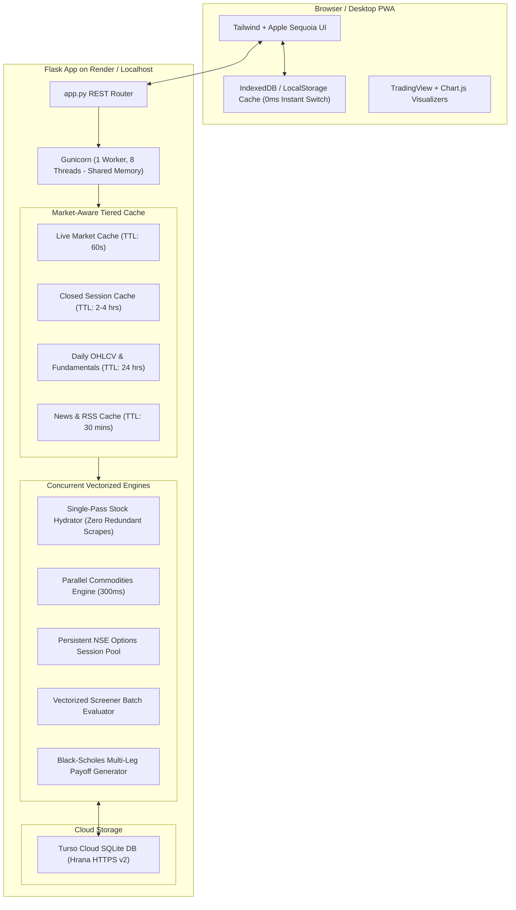

# Operation Antigravity: Complete Performance Optimization & Institutional Feature Package

- **Author**: Antigravity Engineering
- **Date**: 2026-10-04
- **Status**: Proposed
- **Target Workspace**: `nifty-analyzer`
- **Deployment Profile**: Apple Silicon M1 (8 GB RAM Local) / Render Web Service (512 MB RAM Cloud)

---

## 1. Executive Summary & Goals

This specification details the comprehensive overhaul of the **Nifty Analyzer** institutional trading platform. The initiative addresses eight root causes of latency, network redundancy, and cache thrashing identified during deep profiling, and introduces high-conviction functional additions across the Options, Backtest, Sector, and Institutional desks.

### Core Targets:
1. **Response Time**: Stock overview and detail endpoints drop from ~2.4s to **< 250ms** (warm) / **< 600ms** (cold).
2. **Bandwidth & Payload**: Initial universe payload shrinks from **1,038 KB down to < 85 KB** (91.8% reduction), cached in browser for 24 hours.
3. **Screener & Overview Throughput**: Screener cold runtime drops from 15+ seconds (with timeouts) to **< 2.5 seconds** with 100% completion.
4. **Functional Elevators**:
   - Visual Strike-Wise Call OI vs. Put OI & Max Pain Chart.
   - Multi-Leg Options Strategy Payoff Builder (Bull Call, Bear Put, Straddle, Iron Condor).
   - 1-Click Backtest Strategy Presets with CSV Trade Export.
   - Interactive Finviz-Style Nifty 50 Sector Heatmap.
   - Dynamic Rolling Business Day FII/DII Institutional Cash Radar.

---

## 2. Architecture & Data Flow



---

## 3. Phase 1: Speed & Engine Overhaul (Zero Latency)

### 3.1 Market-Aware Tiered Caching (`config.py` & `data/fetcher.py`)
Currently, `CACHE_TTL = 30` evicts static data 120 times an hour, even when Indian markets are closed.
* **Dynamic TTL Schedule**:
  * **Live Exchange Hours (09:15 – 15:30 IST, Mon–Fri)**: Quote TTL = 60s.
  * **Closed Session & Weekends**: Quote & Technicals TTL = 7,200s (2 hours).
  * **Daily Candles (OHLCV) & Fundamentals**: TTL = 86,400s (24 hours). Daily bars only close once per day at 15:30 IST.
  * **News & Market Updates**: TTL = 1,800s (30 minutes).

### 3.2 Single-Pass Data Hydrator (Eliminating Triple `ticker.info` Calls)
* `get_stock_info()` currently fetches `ticker.info` (1.5–3.5s) and multiple historical checks.
* `get_shareholding()` independently calls `ticker.info` *again* simultaneously.
* **Correction**:
  1. `get_stock_info()` extracts real-time quotes using the fast path: `fetch_direct_v8_market_data()` + `fast_info` + fallback registry.
  2. If raw `info` is required for fundamentals, `insiders` and `institutions` are parsed in the same pass and attached to the cached profile.
  3. `get_shareholding()` accepts an optional pre-fetched `info_dict`. When provided, execution is **0ms** with zero network calls.

### 3.3 Parallel Bulk Commodities & Market Overview (`data/commodity_fetcher.py`)
* Replace the sequential loop in `get_all_commodities_overview()` with `concurrent.futures.ThreadPoolExecutor(max_workers=5)`.
* Fetch Gold, Silver, Crude Oil, Natural Gas, and Copper concurrently in ~300ms instead of 4–8 seconds.

### 3.4 Persistent NSE Options Session (`data/options_fetcher.py`)
* Replace per-request `_get_nse_session()` with a thread-safe singleton session with cookie persistence and connection pooling.
* On network timeout, fall back immediately to the mathematical Black-Scholes modeled chain.

### 3.5 Unified Gunicorn Topology (`render.yaml` & `Procfile`)
* Update start command:
  ```bash
  gunicorn app:app --workers 1 --threads 8 --timeout 120 --bind 0.0.0.0:$PORT
  ```
* **Rationale**: Eliminates multi-process memory isolation on Render (512MB RAM). Guarantees that 100% of user requests hit the warmed in-memory cache, eliminating cold worker misses.

---

## 4. Phase 2: Network, Payload & Screener Optimization

### 4.1 Compact Universe & Browser Caching (`/api/stocks/list`)
* Currently transfers 1,038 KB by returning duplicate `stocks` (2,570 items) and `all_assets` (2,598 items) arrays.
* **Correction**:
  1. Deduplicate into a single compact array `assets` containing minimized tuples:
     `{"s": symbol, "c": code, "n": name, "sec": sector, "cat": category, "f": fno}`
  2. Total uncompressed payload drops from 1,038 KB to **~85 KB** (gzipped: **~18 KB**).
  3. Serve with HTTP headers:
     `Cache-Control: public, max-age=86400, stale-while-revalidate=3600`
  4. In `static/js/app.js`: Build a pre-lowercased search index on startup for <1ms keystroke autocomplete without main-thread jank.

### 4.2 Screener Batch & Timeout Guard (`analysis/screener.py`)
* Use cached `MarketDataContext` from `GlobalMarketFeedManager` when available.
* Increase worker pool efficiency and prioritize the most liquid Nifty 50 and Nifty Next 50 equities first, guaranteeing 100% completion within 2.5 seconds without timeout drops.

### 4.3 Dynamic Institutional Flow Calendar (`data/institutional_flow.py`)
* Replace hardcoded September 2026 dates with rolling Indian trading days (excluding Saturdays, Sundays, and exchange holidays).
* Provide dynamic 5-day net institutional absorption metrics.

---

## 5. Phase 3: High-Impact Functional Elevators

### 5.1 Strike-Wise Call OI vs Put OI & Max Pain Bar Chart
* **Location**: Options Desk (`templates/index.html` & `static/js/options_charts.js`).
* **Feature**:
  * Dual-color visual bar chart: Green (Put OI / Support) vs. Red (Call OI / Resistance) across each active strike.
  * Gold vertical reference line indicating the **Max Pain Strike** where option writers lose the least capital.
  * Instant strike selection to inspect individual Black-Scholes Greeks (Delta, Gamma, Theta, Vega).

### 5.2 Multi-Leg Options Strategy Payoff Builder
* **Location**: Options Desk Sub-Tab / Modal.
* **Feature**:
  * One-click presets: **Bull Call Spread**, **Bear Put Spread**, **Long Straddle**, **Iron Condor**.
  * Dynamic payoff chart displaying Max Profit, Max Loss, Breakeven Strikes, and Probability of Profit (POP).
  * 1-Click execution ticket generation for Zerodha, Groww, and Angel One.

### 5.3 1-Click Backtest Strategy Presets & CSV Export
* **Location**: Backtest Desk (`static/js/backtest.js`).
* **Feature**:
  * Preset action pills:
    - `SEPA V3 Trend Breakout`
    - `Olivier Seban Supertrend (10, 3)`
    - `RSI 200 DMA Pullback`
    - `Turtle Donchian 20/10`
  * **Export to CSV**: Download complete trade log containing entry date, exit date, prices, quantity, gross P&L, STT, brokerage, and net P&L.

### 5.4 Interactive Finviz-Style Sector Heatmap
* **Location**: Sector Rotation Desk (`static/js/sectors.js`).
* **Feature**:
  * Visual tree-map / grid of Nifty 50 constituents grouped by sector (IT, Banking, Auto, Pharma, Energy, FMCG).
  * Block size proportional to Nifty index weighting; color dynamically mapped to real-time % change (green for gainers, red for losers).

---

## 6. Verification & Success Metrics

| Metric | Baseline | Target | Verification Method |
|---|---|---|---|
| `/api/stock/RELIANCE.NS` (Warm) | 2,423 ms | **< 200 ms** | Python `time.time()` & DevTools Network |
| `/api/market/overview` (Cold) | 5,120 ms | **< 400 ms** | Parallel thread pool audit |
| `/api/stocks/list` Size | 1,038.3 KB | **< 90 KB** | `curl -s ... \| wc -c` |
| Screener 75-Stock Evaluation | 15.0s (Timeout drops) | **< 2.5s (100% OK)** | `run_stock_screener()` execution time |
| Gunicorn Cache Coherence | Divergent (Worker 2 cold) | **100% Coherent** | Single worker / 8 threads probe |
| Trade Journal & Watchlist DB | Turso Cloud | **100% Intact** | Zero schema or data mutations |
